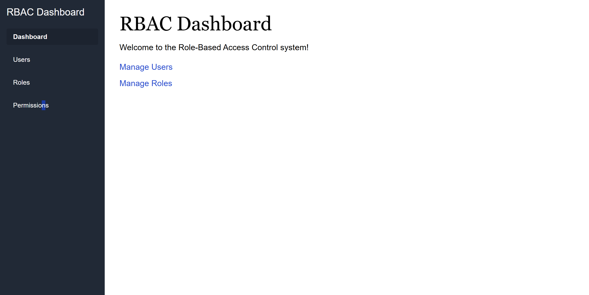
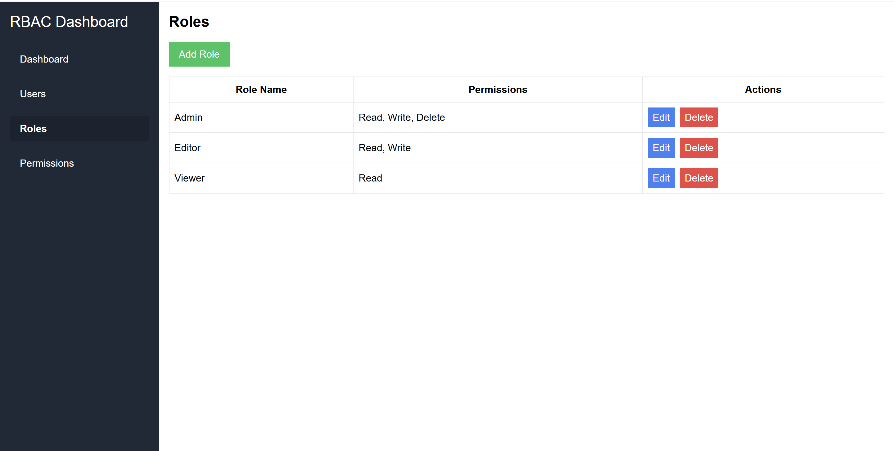
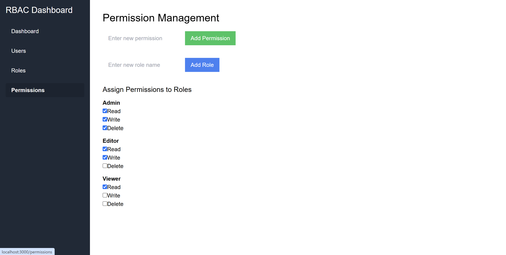

### Project Title: Role-Based Access Control (RBAC) UI

#### Project Overview:
This project is a web-based Role-Based Access Control (RBAC) dashboard designed to allow administrators to manage users, roles, and permissions efficiently. It provides a user-friendly interface to perform CRUD operations on users and roles, assign roles to users, and define permissions for roles dynamically.

The application is responsive, ensuring usability across devices, and follows best practices for secure and maintainable code.

---

#### Flow of the Project:

src/
|- component/
|  |-Modal.js
|  |-PermissionMatrix.js
|  |-RoleTable.js
|  |-Sidebar.js
|  |-UserTable.js
|- context/
|  |-RBACContext.js
|  |-RBACProvider.js
|- pages/
|  |-Dashboard.js
|  |-NotFound.js
|  |-Permissions.js
|  |-Roles.js
|  |-Users.js
|-services/
|  |-api.js
|  |-mockData.js
|-styles/
|  |-style.css
|-utils/
|  |-helpers.js
|-App.js
|-index.js

PermissionMatrix.js- it manages the permisson

RoleTable.js - it manages the roles

UserTable.js - it handles the users

mockData.js - it stores the mock data

#### Getting Started:
1. Prerequisites
Ensure you have the following installed on your system:

   - Node.js (v14 or higher)
   - npm (Node Package Manager)

2. Setup Instructions
   - Clone the repository:
         git clone
         cd rbac-ui
   - Install dependencies:
         npm install

   - Start the development server:
         npm start

   - Open the application in your browser:
         http://localhost:3000

#### Technology Stack:
1. Frontend: 
   - React.js
   - React Router (for routing)
   - CSS (for styling)
   - Tailwind CSS (for utility-first CSS)
   - Create React App (for project setup)

2. Backend
   -  Mock API using mockAPI.js

---

#### Features:

1. User Management
View a list of users with details like username, role, and status (Active/Inactive).
Add new users with a username, role, and status.
Edit existing user details, including changing roles or updating the status.
Delete users with a confirmation prompt to prevent accidental removal.
Search and filter users by role or username.

2. Role Management
View a list of roles with associated permissions.
Add and edit roles with customizable permissions (e.g., Read, Write, Delete).
Delete roles with the ability to reassign associated users to another role.

3. Permission Management
Dynamically assign or modify permissions (Read, Write, Delete) for each role.
Display role-based permissions in an intuitive, hierarchical structure.

4. Additional Features
Responsive design for seamless usability on desktop and mobile devices.
Confirmation dialogs for sensitive actions (e.g., deleting users or roles).
Interactive feedback, such as success/error messages and loading indicators.
Mock API integration to simulate server calls for CRUD operations.

---

#### Flow Diagram:

1. User Interaction:
   - User clicks a link in the sidebar.
   - The corresponding route is matched in the `Routes` component.

2. Routing Process:
   - `App` component handles route matching and renders the correct page.
   - The `useLocation` hook identifies the current path and passes it to the `Sidebar`.

3. Sidebar Highlighting:
   - The `Sidebar` compares the current path with its links.
   - Highlights the active link with unique styling.

4. Content Display:
   - The selected page component (e.g., `Users`, `Roles`) is rendered in the main content area.

---

#### Possible Extensions:
1. Authentication:
   - Add login functionality with role-based access control (RBAC).

2. Dynamic Sidebar Items:
   - Fetch sidebar links dynamically from an API or configuration file.

3. State Management:
   - Use a state management library (e.g., Redux or Context API) to manage global states like user roles and permissions.

4. API Integration:
   - Connect the pages to a backend API to fetch real-time data (e.g., list of users, roles).

5. Theme Customization:
   - Add a light/dark theme toggle feature.

---

#### Screenshots:

#### Future Enhancements

   - Implement real API integration with authentication.
   - Add bulk actions for users and roles (e.g., bulk delete or update).
   - Include an activity log for tracking administrative actions.
   - Implement permission inheritance for role hierarchies.

#### Contact
For any queries or feedback, please contact:
   - Mahwish Rizwan: mahwishrzwn@gmail.com
GitHub Profile: https://github.com/MahwishRizwan

#### Conclusion:
This Admin Dashboard showcases the implementation of a simple yet effective navigation system with active route highlighting. It emphasizes clean UI/UX design principles and serves as a foundation for building more complex applications, such as admin panels, content management systems, or role-based dashboards.

# Getting Started with Create React App

This project was bootstrapped with [Create React App](https://github.com/facebook/create-react-app).

## Available Scripts

In the project directory, you can run:

### `npm start`

Runs the app in the development mode.\
Open [http://localhost:3000](http://localhost:3000) to view it in your browser.

The page will reload when you make changes.\
You may also see any lint errors in the console.

### `npm test`

Launches the test runner in the interactive watch mode.\
See the section about [running tests](https://facebook.github.io/create-react-app/docs/running-tests) for more information.

### `npm run build`

Builds the app for production to the `build` folder.\
It correctly bundles React in production mode and optimizes the build for the best performance.

The build is minified and the filenames include the hashes.\
Your app is ready to be deployed!

See the section about [deployment](https://facebook.github.io/create-react-app/docs/deployment) for more information.

### `npm run eject`

**Note: this is a one-way operation. Once you `eject`, you can't go back!**

If you aren't satisfied with the build tool and configuration choices, you can `eject` at any time. This command will remove the single build dependency from your project.

Instead, it will copy all the configuration files and the transitive dependencies (webpack, Babel, ESLint, etc) right into your project so you have full control over them. All of the commands except `eject` will still work, but they will point to the copied scripts so you can tweak them. At this point you're on your own.

You don't have to ever use `eject`. The curated feature set is suitable for small and middle deployments, and you shouldn't feel obligated to use this feature. However we understand that this tool wouldn't be useful if you couldn't customize it when you are ready for it.

## Learn More

You can learn more in the [Create React App documentation](https://facebook.github.io/create-react-app/docs/getting-started).

To learn React, check out the [React documentation](https://reactjs.org/).

### Code Splitting

This section has moved here: [https://facebook.github.io/create-react-app/docs/code-splitting](https://facebook.github.io/create-react-app/docs/code-splitting)

### Analyzing the Bundle Size

This section has moved here: [https://facebook.github.io/create-react-app/docs/analyzing-the-bundle-size](https://facebook.github.io/create-react-app/docs/analyzing-the-bundle-size)

### Making a Progressive Web App

This section has moved here: [https://facebook.github.io/create-react-app/docs/making-a-progressive-web-app](https://facebook.github.io/create-react-app/docs/making-a-progressive-web-app)

### Advanced Configuration

This section has moved here: [https://facebook.github.io/create-react-app/docs/advanced-configuration](https://facebook.github.io/create-react-app/docs/advanced-configuration)

### Deployment

This section has moved here: [https://facebook.github.io/create-react-app/docs/deployment](https://facebook.github.io/create-react-app/docs/deployment)

### `npm run build` fails to minify

This section has moved here: [https://facebook.github.io/create-react-app/docs/troubleshooting#npm-run-build-fails-to-minify](https://facebook.github.io/create-react-app/docs/troubleshooting#npm-run-build-fails-to-minify)
# RBAC-Assignment


